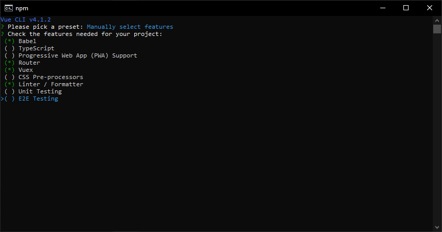

# VueJS tutorial

## create new project

0. install VueJS
    ```
    npm install -g @vue/cli
    ```

1. create new project
    ```
    vue create vue-dev-01
    ```

2. select `Manually select features` to create new preset

3. choose following features on your project
    

4. use history mode for router? `Yes`

5. Pick a linter `ESLint with error prevention only`

6. Pick additional lint features `Lint on save`

7. Where do you prefer placing config for Bebel, ESLint, etc.? `In dedicated config files`

8. Save this as a preset `Yes`

9. finish
    ```
    $ cd vue-dev-01
    $ npm run serve
    ```

